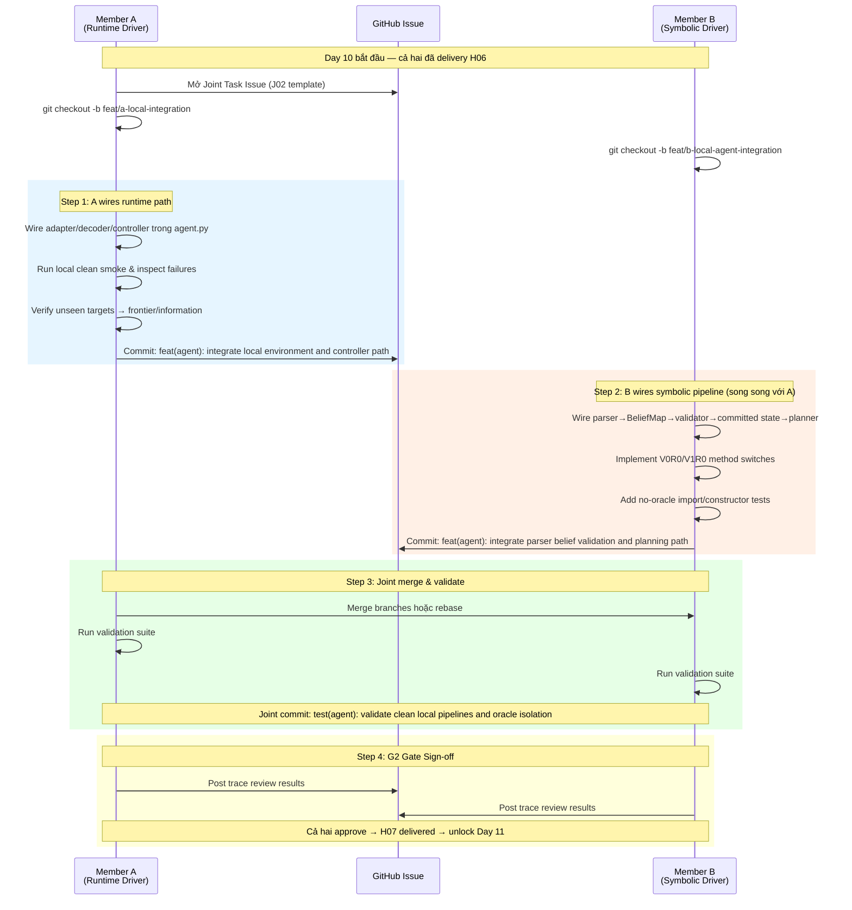

# Task B-J02 / A-J02: Clean Local V0R0/V1R0 Integration — Hướng dẫn phối hợp chi tiết

> **Day 10 — Gate G2 — Handoff H07**
> Kết quả: V0R0/V1R0 chạy local clean, zero oracle leakage, all outcomes typed.

---

## 1. Tổng quan Task

| Thuộc tính | Giá trị |
|---|---|
| **Task ID** | `B-J02` (Member B) / `A-J02` (Member A) |
| **Ngày** | Day 10 |
| **Gate** | G2 — Clean local pipeline |
| **Handoff** | H07 |
| **Driver** | A cho runtime, B cho symbolic pipeline |
| **Branch A** | `feat/a-local-integration` |
| **Branch B** | `feat/b-local-agent-integration` |

### Mục tiêu chính
Kết nối toàn bộ local pipeline (Observation Decoder → Parser → BeliefMap → Validator → CommittedPlanningState → Serializer → Planner → Controller) trong môi trường **không có oracle leakage**, với 2 method switches:

- **V0R0**: Transport/schema checks only, không validation, không replanning
- **V1R0**: Full validation trước planning, không replanning

---

## 2. Prerequisites — Phải hoàn thành trước khi bắt đầu J02

### Member A đã deliver:
| Task | Output | Files |
|---|---|---|
| A-01 | Package layout, dependencies | `pyproject.toml`, `uv.lock` |
| A-02 | MiniGrid adapter, probe envs, verifier | [minigrid_adapter.py](file:///home/hiiluo08/Works/NeuSym-Nav/src/neuro_symbolic_vln/env/minigrid_adapter.py), [tasks.py](file:///home/hiiluo08/Works/NeuSym-Nav/src/neuro_symbolic_vln/env/tasks.py), [verifier.py](file:///home/hiiluo08/Works/NeuSym-Nav/src/neuro_symbolic_vln/env/verifier.py) |
| A-J01 | Primitive controller, B3 execution | [controller.py](file:///home/hiiluo08/Works/NeuSym-Nav/src/neuro_symbolic_vln/control/controller.py) |
| A-03 | Local observation decoder, dead reckoning | [observation_decoder.py](file:///home/hiiluo08/Works/NeuSym-Nav/src/neuro_symbolic_vln/perception/observation_decoder.py) |
| A-04 | Oracle, manifests (evaluation-only) | [oracle.py](file:///home/hiiluo08/Works/NeuSym-Nav/src/neuro_symbolic_vln/evaluation/oracle.py), [manifests.py](file:///home/hiiluo08/Works/NeuSym-Nav/src/neuro_symbolic_vln/evaluation/manifests.py) |

### Member B đã deliver:
| Task | Output | Files |
|---|---|---|
| B-01 | Shared typed contracts | [contracts.py](file:///home/hiiluo08/Works/NeuSym-Nav/src/neuro_symbolic_vln/contracts.py) |
| B-02 | LocationGraph, PDDL, serializer, pyperplan adapter | [location_graph.py](file:///home/hiiluo08/Works/NeuSym-Nav/src/neuro_symbolic_vln/planning/location_graph.py), [problem_serializer.py](file:///home/hiiluo08/Works/NeuSym-Nav/src/neuro_symbolic_vln/planning/problem_serializer.py), [pyperplan_adapter.py](file:///home/hiiluo08/Works/NeuSym-Nav/src/neuro_symbolic_vln/planning/pyperplan_adapter.py) |
| B-J01 | B3 planning integration | [agent.py](file:///home/hiiluo08/Works/NeuSym-Nav/src/neuro_symbolic_vln/agent.py) |
| B-03 | Deterministic parser | [template_parser.py](file:///home/hiiluo08/Works/NeuSym-Nav/src/neuro_symbolic_vln/language/template_parser.py) |
| B-04 | EvidenceStore, BeliefMap | [evidence.py](file:///home/hiiluo08/Works/NeuSym-Nav/src/neuro_symbolic_vln/belief/evidence.py), [state.py](file:///home/hiiluo08/Works/NeuSym-Nav/src/neuro_symbolic_vln/belief/state.py) |
| B-05 | Validator, CommittedPlanningState builder | [validator.py](file:///home/hiiluo08/Works/NeuSym-Nav/src/neuro_symbolic_vln/belief/validator.py) |

---

## 3. Trình tự phối hợp theo thời gian



---

## 4. Chi tiết công việc từng Member

### 4.1. Member A — Runtime Integration (Commit 1)

**Branch:** `feat/a-local-integration`

**Modify:** [agent.py](file:///home/hiiluo08/Works/NeuSym-Nav/src/neuro_symbolic_vln/agent.py) — hoặc thêm entry function trong file mới

> [!IMPORTANT]
> `agent_v1r1.py` **đã có sẵn** `run_v1r1_episode()` với đầy đủ logic wiring runtime (adapter, decoder, controller, belief loop). A chủ yếu cần đảm bảo:
> 1. CLI route V0R0/V1R0 → `run_v1r1_episode(..., use_validator=False/True, use_recovery=False)`
> 2. Verify smoke episodes chạy được với typed outcomes
> 3. Unseen targets → frontier/information status (không phải oracle location)

**File cần modify:**

#### a) [`cli.py`](file:///home/hiiluo08/Works/NeuSym-Nav/src/neuro_symbolic_vln/cli.py#L149-L173) — Bỏ restriction B3-only cho smoke.yaml

```python
# TRƯỚC (lines 149-153):
# Legacy B3 smoke path (configs/smoke.yaml).
method = args.method or config.get("method")
if method != "B3":
    print(f"unsupported method: {method}", file=sys.stderr)
    return 2

# SAU: Route V0R0/V1R0 qua run_v1r1_episode
method = args.method or config.get("method")

if method in ("V0R0", "V1R0"):
    from neuro_symbolic_vln.agent_v1r1 import run_v1r1_episode

    use_validator = method == "V1R0"
    results = []
    for entry in config["episodes"]:
        for seed in entry["seeds"]:
            results.append(
                run_v1r1_episode(
                    seed=seed,
                    family=entry["family"],
                    method=method,
                    use_validator=use_validator,
                    use_recovery=False,
                )
            )
    successes = sum(1 for r in results if r.task_success)
    print(
        f"{method} smoke: {len(results)} episodes, "
        f"{successes} task successes"
    )
    return 0 if successes == len(results) else 1

elif method != "B3":
    print(f"unsupported method: {method}", file=sys.stderr)
    return 2

# ... existing B3 code continues ...
```

#### b) [`configs/smoke.yaml`](file:///home/hiiluo08/Works/NeuSym-Nav/configs/smoke.yaml) — Không cần sửa (config dùng chung, method override từ CLI `--method`)

#### c) Verify smoke traces — A phải chạy:
```bash
uv run ns-vln evaluate --config configs/smoke.yaml --method V0R0
uv run ns-vln evaluate --config configs/smoke.yaml --method V1R0
```

**Commit message:**
```
feat(agent): integrate local environment and controller path

- Route V0R0/V1R0 methods through run_v1r1_episode in CLI
- V0R0: transport/schema only, use_validator=False, use_recovery=False
- V1R0: full validation, use_validator=True, use_recovery=False
- Verify initially unseen targets use frontier/information status
```

---

### 4.2. Member B — Symbolic Pipeline Integration (Commit 2)

**Branch:** `feat/b-local-agent-integration`

> [!NOTE]
> Codebase hiện tại đã có `agent_v1r1.py` với `_V1R1EpisodeRuntime` class wiring đầy đủ parser→belief→validator→committed state→planner. Member B chủ yếu cần **verify** rằng symbolic path hoạt động đúng, V0R0/V1R0 switches đúng chỗ, và thêm leakage tests.

#### a) Verify V0R0/V1R0 switches trong [`agent_v1r1.py`](file:///home/hiiluo08/Works/NeuSym-Nav/src/neuro_symbolic_vln/agent_v1r1.py#L460-L479)

Đã có sẵn (lines 460-479):
```python
def run_v1r1_episode(
    ...
    method: str = "V1R1",
    use_validator: bool = True,
    use_recovery: bool = True,
    ...
) -> V1R1EpisodeResult:
```

Và logic ở line 241:
```python
if self._use_validator:
    decisions = self._validator.validate(...)
```

Và line 716:
```python
if not use_recovery:
    return episode_result(
        terminal_outcome=EpisodeOutcome.KNOWN_SPACE_DISCONNECTED,
        ...
    )
```

**B cần verify:**
- ✅ V0R0 = `use_validator=False, use_recovery=False` → skips validator, single plan attempt
- ✅ V1R0 = `use_validator=True, use_recovery=False` → full validator, no replan on failure
- ✅ Unknown không serialize như false/free
- ✅ `oracle_input` phải là `false` cho V0R0/V1R0 traces

#### b) **Modify:** [`tests/test_no_oracle_leakage.py`](file:///home/hiiluo08/Works/NeuSym-Nav/tests/test_no_oracle_leakage.py) — Thêm constructor/sidecar leakage tests

```python
"""Forbidden-import guard: the normal agent path must not pull in the
evaluator oracle or manifests."""

import subprocess
import sys

import pytest


def test_normal_agent_import_graph_excludes_oracle() -> None:
    """Existing test: importing agent modules must not load evaluation.*"""
    code = (
        "import sys\n"
        "import neuro_symbolic_vln.agent\n"
        "import neuro_symbolic_vln.control.controller\n"
        "import neuro_symbolic_vln.perception.observation_decoder\n"
        "bad = [\n"
        "    name for name in sys.modules\n"
        "    if name.startswith('neuro_symbolic_vln.evaluation')\n"
        "]\n"
        "assert not bad, f'leaked evaluation modules: {bad}'\n"
    )
    result = subprocess.run(
        [sys.executable, "-c", code], capture_output=True, text=True
    )
    assert result.returncode == 0, result.stderr


# ----------- B-J02 ADDITIONS -----------


def test_belief_pipeline_import_graph_excludes_oracle() -> None:
    """B-J02: Belief pipeline imports must not pull in evaluation modules."""
    code = (
        "import sys\n"
        "import neuro_symbolic_vln.belief.state\n"
        "import neuro_symbolic_vln.belief.validator\n"
        "import neuro_symbolic_vln.belief.evidence\n"
        "import neuro_symbolic_vln.language.template_parser\n"
        "import neuro_symbolic_vln.planning.problem_serializer\n"
        "import neuro_symbolic_vln.planning.pyperplan_adapter\n"
        "bad = [\n"
        "    name for name in sys.modules\n"
        "    if name.startswith('neuro_symbolic_vln.evaluation')\n"
        "]\n"
        "assert not bad, f'leaked evaluation modules: {bad}'\n"
    )
    result = subprocess.run(
        [sys.executable, "-c", code], capture_output=True, text=True
    )
    assert result.returncode == 0, result.stderr


def test_v1r1_runtime_has_no_oracle_constructor_field() -> None:
    """B-J02: _V1R1EpisodeRuntime must not store oracle state or sidecar."""
    from neuro_symbolic_vln.agent_v1r1 import _V1R1EpisodeRuntime
    from neuro_symbolic_vln.contracts import EpisodeSpec

    episode = EpisodeSpec(
        episode_id="test-leak",
        family="goto_type_color",
        instruction="go to the green ball",
        public_action_budget=32,
        manifest_hash="test",
    )
    runtime = _V1R1EpisodeRuntime(episode, "goto_type_color")

    # No attribute should reference oracle, sidecar, or evaluation
    forbidden_prefixes = ("oracle", "sidecar", "_oracle", "_sidecar", "eval")
    for attr_name in dir(runtime):
        if attr_name.startswith("__"):
            continue
        assert not any(
            attr_name.lower().startswith(prefix) for prefix in forbidden_prefixes
        ), f"Runtime has forbidden attribute: {attr_name}"


def test_v0r0_episode_traces_oracle_input_false() -> None:
    """B-J02: V0R0 episodes must record oracle_input=false in all traces."""
    from neuro_symbolic_vln.agent_v1r1 import run_v1r1_episode

    result = run_v1r1_episode(
        seed=0,
        family="goto_type_color",
        method="V0R0",
        use_validator=False,
        use_recovery=False,
    )
    # Episode result itself should not be flagged as oracle_input
    # (V1R1EpisodeResult doesn't have oracle_input field, which is correct
    # — only B3EpisodeResult has oracle_input=True)
    assert not hasattr(result, "oracle_input") or result.oracle_input is False


def test_v1r0_episode_traces_oracle_input_false() -> None:
    """B-J02: V1R0 episodes must record oracle_input=false in all traces."""
    from neuro_symbolic_vln.agent_v1r1 import run_v1r1_episode

    result = run_v1r1_episode(
        seed=0,
        family="goto_type_color",
        method="V1R0",
        use_validator=True,
        use_recovery=False,
    )
    assert not hasattr(result, "oracle_input") or result.oracle_input is False
```

#### c) **Modify:** [`tests/test_end_to_end_smoke.py`](file:///home/hiiluo08/Works/NeuSym-Nav/tests/test_end_to_end_smoke.py) — Thêm V0R0/V1R0 smoke cases

Thêm vào cuối file (sau test hiện tại):

```python
# ---------------------------------------------------------------------------
# 5. Gate G2: V0R0/V1R0 Local Pipeline Smoke Tests (Task B-J02)
# ---------------------------------------------------------------------------

from neuro_symbolic_vln.agent_v1r1 import V1R1EpisodeResult, run_v1r1_episode
from neuro_symbolic_vln.contracts import ParseStatus


class TestV0R0LocalSmoke:
    """V0R0: transport/schema checks only, no validation, no replanning."""

    @pytest.mark.parametrize("family", ["key_door_goal", "goto_type_color"])
    def test_v0r0_episode_runs_with_typed_outcome(self, family: str) -> None:
        result = run_v1r1_episode(
            seed=0,
            family=family,
            method="V0R0",
            use_validator=False,
            use_recovery=False,
        )
        assert result.terminal_outcome is not None, (
            "V0R0 must produce a typed terminal outcome"
        )
        assert isinstance(result.terminal_outcome, EpisodeOutcome)
        assert result.parse_status is ParseStatus.DETERMINISTIC

    @pytest.mark.parametrize("seed", list(range(4)))
    def test_v0r0_goto_across_headings(self, seed: int) -> None:
        result = run_v1r1_episode(
            seed=seed,
            family="goto_type_color",
            method="V0R0",
            use_validator=False,
            use_recovery=False,
        )
        assert result.terminal_outcome is not None
        # V0R0 may or may not succeed, but must always be typed
        assert isinstance(result.terminal_outcome, EpisodeOutcome)


class TestV1R0LocalSmoke:
    """V1R0: full validation before planning, no replanning."""

    @pytest.mark.parametrize("family", ["key_door_goal", "goto_type_color"])
    def test_v1r0_episode_runs_with_typed_outcome(self, family: str) -> None:
        result = run_v1r1_episode(
            seed=0,
            family=family,
            method="V1R0",
            use_validator=True,
            use_recovery=False,
        )
        assert result.terminal_outcome is not None, (
            "V1R0 must produce a typed terminal outcome"
        )
        assert isinstance(result.terminal_outcome, EpisodeOutcome)
        assert result.parse_status is ParseStatus.DETERMINISTIC

    @pytest.mark.parametrize("seed", list(range(4)))
    def test_v1r0_goto_across_headings(self, seed: int) -> None:
        result = run_v1r1_episode(
            seed=seed,
            family="goto_type_color",
            method="V1R0",
            use_validator=True,
            use_recovery=False,
        )
        assert result.terminal_outcome is not None
        assert isinstance(result.terminal_outcome, EpisodeOutcome)


class TestG2OracleIsolation:
    """G2 gate: zero oracle leakage in V0R0/V1R0 execution paths."""

    def test_v0r0_has_no_oracle_input_flag(self) -> None:
        result = run_v1r1_episode(
            seed=0,
            family="goto_type_color",
            method="V0R0",
            use_validator=False,
            use_recovery=False,
        )
        # V1R1EpisodeResult intentionally omits oracle_input field
        # (only B3EpisodeResult has oracle_input=True)
        assert not hasattr(result, "oracle_input") or not result.oracle_input

    def test_v1r0_has_no_oracle_input_flag(self) -> None:
        result = run_v1r1_episode(
            seed=0,
            family="goto_type_color",
            method="V1R0",
            use_validator=True,
            use_recovery=False,
        )
        assert not hasattr(result, "oracle_input") or not result.oracle_input

    def test_unknown_not_serialized_as_false(self) -> None:
        """Unknown facts must NOT appear as false/free in PDDL init.
        
        Verify by checking that belief hash changes between V0R0 and V1R0
        (validator filters additional facts), meaning validation is active.
        """
        r_v0r0 = run_v1r1_episode(
            seed=0,
            family="goto_type_color",
            method="V0R0",
            use_validator=False,
            use_recovery=False,
        )
        r_v1r0 = run_v1r1_episode(
            seed=0,
            family="goto_type_color",
            method="V1R0",
            use_validator=True,
            use_recovery=False,
        )
        # Both must produce non-empty belief hashes
        assert r_v0r0.belief_state_hash
        assert r_v1r0.belief_state_hash
```

**Commit message:**
```
feat(agent): integrate parser belief validation and planning path

- Verify V0R0/V1R0 method switches in _V1R1EpisodeRuntime
- V0R0: transport/schema only, skips StandardValidator
- V1R0: full validation via StandardValidator, single plan attempt
- Add belief pipeline oracle isolation tests
- Add constructor/sidecar leakage guards
```

---

### 4.3. Joint — Validation & G2 Sign-off (Commit 3)

Sau khi cả hai merge branches, cùng chạy validation suite:

```bash
# 1. Oracle leakage (phải PASS)
uv run pytest tests/test_no_oracle_leakage.py -v

# 2. End-to-end smoke — cả B3 (G1) và V0R0/V1R0 (G2)
uv run pytest tests/test_end_to_end_smoke.py -v

# 3. CLI evaluate commands
uv run ns-vln evaluate --config configs/smoke.yaml --method V0R0
uv run ns-vln evaluate --config configs/smoke.yaml --method V1R0
```

**Expected results cho G2 pass:**

| Criteria | Expected |
|---|---|
| Parser 40/40 categories | ✅ |
| Clean visible facts precision/recall 100% | ✅ |
| Unknown không serialize như false/free | ✅ |
| Unseen targets → frontier/information | ✅ |
| V0R0/V1R0 typed outcomes | ✅ |
| Zero oracle import/constructor/sidecar | ✅ |

**Joint commit message:**
```
test(agent): validate clean local pipelines and oracle isolation

- V0R0/V1R0 smoke episodes produce typed outcomes
- Oracle leakage tests pass for both belief and runtime paths
- Constructor/sidecar isolation verified
- G2 gate criteria met; H07 handoff complete
```

---

## 5. Tổng hợp Files — Ai tạo/sửa cái gì

| File | Action | Owner | Mô tả |
|---|---|---|---|
| [`cli.py`](file:///home/hiiluo08/Works/NeuSym-Nav/src/neuro_symbolic_vln/cli.py) | **Modify** | **A** | Route V0R0/V1R0 qua `run_v1r1_episode` |
| [`agent_v1r1.py`](file:///home/hiiluo08/Works/NeuSym-Nav/src/neuro_symbolic_vln/agent_v1r1.py) | **Verify** | **B** | Xác nhận V0R0/V1R0 switches đúng |
| [`test_no_oracle_leakage.py`](file:///home/hiiluo08/Works/NeuSym-Nav/tests/test_no_oracle_leakage.py) | **Modify** | **B** | Thêm belief pipeline + constructor leakage tests |
| [`test_end_to_end_smoke.py`](file:///home/hiiluo08/Works/NeuSym-Nav/tests/test_end_to_end_smoke.py) | **Modify** | **Joint** | Thêm V0R0/V1R0 smoke test classes |
| [`configs/smoke.yaml`](file:///home/hiiluo08/Works/NeuSym-Nav/configs/smoke.yaml) | **Không sửa** | — | Dùng chung, method override từ CLI `--method` |

> [!TIP]
> Không cần tạo file mới — codebase đã có sẵn `agent_v1r1.py` với đầy đủ runtime logic. Công việc chính của J02 là **wiring + verification + leakage tests**.

---

## 6. Tóm tắt Commits theo thứ tự

| # | Who | Branch | Commit Message |
|---|---|---|---|
| 1 | **A** | `feat/a-local-integration` | `feat(agent): integrate local environment and controller path` |
| 2 | **B** | `feat/b-local-agent-integration` | `feat(agent): integrate parser belief validation and planning path` |
| 3 | **Joint** | merge branch | `test(agent): validate clean local pipelines and oracle isolation` |

---

## 7. Sau khi hoàn thành J02

Khi G2 được sign-off → H07 delivered → unlock:
- **A → Day 11–12:** Task A-05 (Deterministic frontier explorer)
- **B → Day 11–12:** Task B-06 (Execution monitor & bounded replanning)
