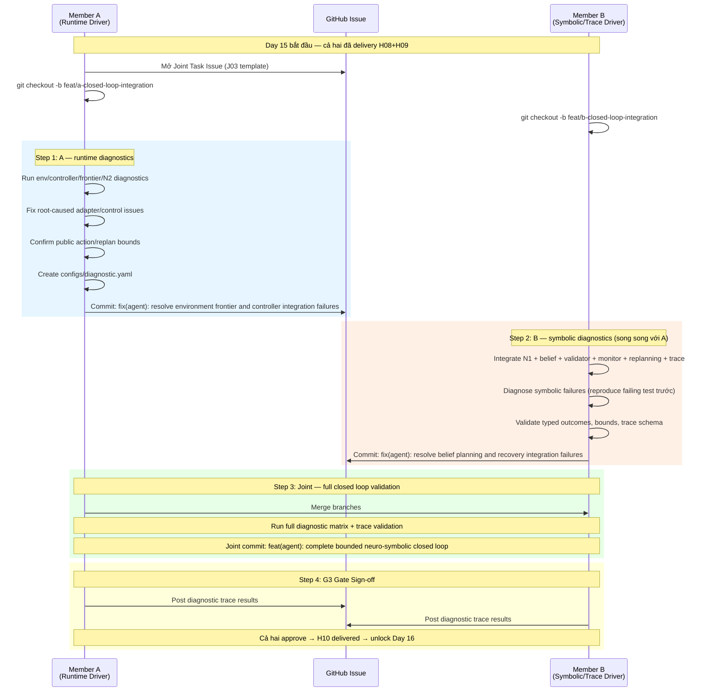

# Task B-J03 / A-J03: Full V1R1 Diagnostic Integration — Hướng dẫn phối hợp chi tiết

> **Day 15 — Gate G3 — Handoff H10**
> Kết quả: V1R1 closed loop xử lý N1/N2 diagnostics, bounded replan/loop, all outcomes typed, traces schema-valid/replayable.

---

## 1. Tổng quan Task

| Thuộc tính | Giá trị |
|---|---|
| **Task ID** | `B-J03` (Member B) / `A-J03` (Member A) |
| **Ngày** | Day 15 |
| **Gate** | G3 — Full bounded closed loop |
| **Handoff** | H10 |
| **Driver** | A cho runtime, B cho symbolic/trace |
| **Branch A** | `feat/a-closed-loop-integration` |
| **Branch B** | `feat/b-closed-loop-integration` |

### Mục tiêu chính
Tích hợp **toàn bộ V1R1 closed-loop pipeline** — bao gồm N1 corruption, N2 interventions, bounded replanning, frontier exploration, typed trace/replay — và xác nhận mọi scenario đều kết thúc đúng typed terminal outcome trong bounded budget.

### So sánh với J02

| | J02 (Day 10) | J03 (Day 15) |
|---|---|---|
| **Methods** | V0R0, V1R0 | **V1R1** (full) |
| **Replanning** | Không | **Có** — bounded max 5 |
| **N1 corruption** | Không | **Có** — DROP/FLIP |
| **N2 interventions** | Không | **Có** — block/relock |
| **Trace/replay** | Chưa có | **Có** — full JSONL schema |
| **Gate** | G2 | **G3** |

---

## 2. Prerequisites — Phải hoàn thành trước khi bắt đầu J03

### Member A đã deliver (Day 11–14):

| Task | Day | Output | Key Files |
|---|---|---|---|
| A-05 | 11–12 | Deterministic frontier explorer | `src/neuro_symbolic_vln/control/explorer.py` |
| A-06 | 13–14 | N2 fixed interventions (block + relock) | `src/neuro_symbolic_vln/evaluation/interventions.py` |
| *G2* | 10 | Clean local V0R0/V1R0 pipeline | — |

### Member B đã deliver (Day 11–14):

| Task | Day | Output | Key Files |
|---|---|---|---|
| B-06 | 11–12 | Execution monitor, bounded replanning | `src/neuro_symbolic_vln/control/monitor.py` |
| B-07 | 13 | N1 corruption (DROP/FLIP), reliability model | `src/neuro_symbolic_vln/evaluation/corruption.py` |
| B-08 | 14 | Typed outcomes, JSONL trace, canonical hashes, replay | `src/neuro_symbolic_vln/trace.py` |

### Handoffs đã nhận:

| Handoff | A → B | B → A | Day |
|---|---|---|---|
| H08 | Frontier events, primitive feedback | Monitor/replan decisions | 12 |
| H09 | N2 checkpoints/events + diagnostic config | N1 checkpoint + full trace schemas | 14 |

---

## 3. Trình tự phối hợp theo thời gian



---

## 4. Chi tiết công việc từng Member

### 4.1. Member A — Runtime Diagnostics (Commit 1)

**Branch:** `feat/a-closed-loop-integration`

#### a) **Create:** `configs/diagnostic.yaml` — V1R1 diagnostic config

> Config này chưa tồn tại trong codebase. A cần tạo nó cho validation commands.

```yaml
# V1R1 diagnostic configuration (Gate G3).
# Covers: clean episodes, N1 corruption, N2 interventions.
run_id: diagnostic
method: V1R1
condition: diagnostic
manifests_dir: data/manifests
output_dir: runs/diagnostic
splits:
  - test
diagnostics:
  - name: clean
    corruption: null
    intervention: null
  - name: n1_drop_15
    corruption:
      type: drop
      rate: 0.15
      seed: 42
    intervention: null
  - name: n1_flip_10
    corruption:
      type: flip
      rate: 0.10
      seed: 42
    intervention: null
  - name: n2_block
    corruption: null
    intervention:
      type: block
  - name: n2_relock
    corruption: null
    intervention:
      type: relock
notes: |
  Diagnostic matrix exercises V1R1 closed loop under:
  - Clean (baseline reference)
  - N1-DROP-15 / N1-FLIP-10 (evidence corruption)
  - N2-BLOCK / N2-RELOCK (world interventions)
  All outcomes must be typed; replan/loop bounds must hold.
```

#### b) **Modify:** Runtime fixes trong `agent_v1r1.py` — nếu phát hiện env/controller/frontier bugs

Các loại lỗi A phải fix:
- Adapter không trả đúng `StepResult` sau N2 intervention
- Controller mapping sai khi frontier explores new cells
- Action budget không đúng khi replan đến vùng mới
- N2 `apply_intervention()` timing sai so với checkpoint

#### c) **Modify:** `cli.py` — thêm `validate-traces` subcommand nếu chưa có

```python
# Thêm subcommand validate-traces (nếu chưa có)
def _run_validate_traces(args: Namespace) -> int:
    from neuro_symbolic_vln.trace import (
        deserialize_record,
        scan_record_for_leakage,
        TraceSchemaError,
    )
    import json
    from pathlib import Path

    runs_dir = Path(args.runs)
    violations = []
    record_count = 0

    for jsonl_file in sorted(runs_dir.rglob("*.jsonl")):
        for line_no, line in enumerate(jsonl_file.read_text().splitlines(), 1):
            if not line.strip():
                continue
            record_count += 1
            try:
                record = deserialize_record(line)
            except TraceSchemaError as exc:
                violations.append(f"{jsonl_file}:{line_no}: schema error: {exc}")
                continue
            leaks = scan_record_for_leakage(record)
            for leak in leaks:
                violations.append(f"{jsonl_file}:{line_no}: {leak}")

    print(f"validate-traces: {record_count} records scanned")
    for v in violations:
        print(f"  VIOLATION: {v}", file=sys.stderr)
    return 0 if not violations else 6
```

**Commit message:**
```
fix(agent): resolve environment frontier and controller integration failures

- Create configs/diagnostic.yaml for V1R1 diagnostic matrix
- Fix adapter/controller issues discovered during N2 integration
- Confirm public action budget and replan bounds hold
- Add validate-traces CLI subcommand
```

---

### 4.2. Member B — Symbolic/Trace Diagnostics (Commit 2)

**Branch:** `feat/b-closed-loop-integration`

#### a) **Debug & fix:** Symbolic pipeline issues trong closed loop

Khi chạy V1R1 diagnostic, B phải reproduce failing test trước khi fix. Các loại lỗi B sở hữu:

| Symptom | Root cause (B owns) | Where to fix |
|---|---|---|
| Untyped terminal outcome | Missing branch trong monitor/agent | `control/monitor.py`, `agent_v1r1.py` |
| Unbounded replan loop | Budget check bypass | `control/monitor.py` |
| N1 corruption → belief wrong | Validator accepts corrupted evidence | `belief/validator.py` |
| Plan fails after invalidation | CommittedState stale atoms | `belief/state.py` |
| Trace schema invalid | Missing/wrong fields in JSONL | `trace.py` |
| Replay mismatch | Non-deterministic belief hash | `belief/state.py` |

#### b) Verify existing V1R1 tests pass — đây là baseline:

```bash
# Phải PASS trước khi bắt đầu J03
uv run pytest tests/test_agent_v1r1.py -v
uv run pytest tests/control/test_replanning.py -v
uv run pytest tests/evaluation/test_corruption.py -v
uv run pytest tests/test_trace.py -v
```

Các test đã có trong `test_agent_v1r1.py`:
- ✅ `test_v1r1_solves_clean_goto_across_all_headings` (4 seeds)
- ✅ `test_v1r1_solves_clean_keydoor_across_all_headings` (4 seeds)
- ✅ `test_v1r1_recovers_from_block_intervention_where_v1r0_fails`
- ✅ `test_v1r1_recovers_from_relock_intervention_where_v1r0_fails`

**Commit message:**
```
fix(agent): resolve belief planning and recovery integration failures

- Fix symbolic pipeline issues discovered during V1R1 diagnostics
- Ensure N1 corruption scenarios produce typed outcomes
- Validate bounded replanning under N2 interventions
- Trace schema validation passes for all diagnostic scenarios
```

---

### 4.3. Joint — Full Closed Loop Validation (Commit 3)

Sau khi cả hai merge branches, tạo **diagnostic integration tests** và chạy full validation.

#### a) **Modify:** `tests/test_end_to_end_smoke.py` — thêm V1R1 diagnostic section

```python
# ---------------------------------------------------------------------------
# 6. Gate G3: V1R1 Full Bounded Closed Loop Diagnostics (Task B-J03)
# ---------------------------------------------------------------------------

from neuro_symbolic_vln.agent_v1r1 import V1R1EpisodeResult, run_v1r1_episode
from neuro_symbolic_vln.evaluation.interventions import (
    choose_block_intervention,
    choose_relock_intervention,
)


class TestV1R1DiagnosticSmoke:
    """G3: V1R1 handles all diagnostic scenarios with typed outcomes."""

    @pytest.mark.parametrize("family", ["key_door_goal", "goto_type_color"])
    def test_v1r1_clean_typed_outcome(self, family: str) -> None:
        """Clean V1R1 episodes must succeed with typed outcomes."""
        result = run_v1r1_episode(seed=0, family=family)
        assert result.task_success
        assert result.terminal_outcome is EpisodeOutcome.SUCCESS

    def test_v1r1_n2_block_recovery(self) -> None:
        """V1R1 must recover from N2 block via bounded replan."""
        spec = choose_block_intervention(
            (2, 1), ((1, 2), (2, 2), (3, 2), (4, 2), (4, 1)), seed=40
        )
        result = run_v1r1_episode(
            seed=40,
            family="goto_type_color",
            intervention=spec,
        )
        assert result.task_success
        assert result.replan_count >= 1
        assert result.replan_count <= 5  # bounded budget

    def test_v1r1_n2_relock_recovery(self) -> None:
        """V1R1 must recover from N2 relock via bounded replan."""
        spec = choose_relock_intervention((3, 1), seed=32)
        result = run_v1r1_episode(
            seed=32,
            family="key_door_goal",
            intervention=spec,
        )
        assert result.task_success
        assert result.replan_count >= 1
        assert result.replan_count <= 5  # bounded budget

    @pytest.mark.parametrize("family", ["key_door_goal", "goto_type_color"])
    def test_v1r1_all_outcomes_typed_never_none(self, family: str) -> None:
        """No episode may terminate with terminal_outcome=None."""
        result = run_v1r1_episode(seed=0, family=family)
        assert result.terminal_outcome is not None
        assert isinstance(result.terminal_outcome, EpisodeOutcome)


class TestV1R1BoundsEnforcement:
    """G3: Replan/loop/action bounds must be enforced."""

    def test_replan_budget_max_5(self) -> None:
        """Replanning must be bounded at max 5 attempts."""
        from neuro_symbolic_vln.control.monitor import ExecutionMonitor

        monitor = ExecutionMonitor(max_replans=5)
        for _ in range(5):
            outcome = monitor.check_replan_budget()
            assert outcome is None  # still within budget
        outcome = monitor.check_replan_budget()
        assert outcome is not None  # 6th attempt rejected

    def test_deliberate_loop_detected(self) -> None:
        """Third identical plan signature must trigger LOOP_DETECTED."""
        from neuro_symbolic_vln.control.monitor import ExecutionMonitor

        monitor = ExecutionMonitor()
        sig = ("task-satisfied", "hash-1", ("loc-1", "east"), "found")
        assert monitor.record_and_check_loop(sig) is None  # 1st
        assert monitor.record_and_check_loop(sig) is None  # 2nd
        outcome = monitor.record_and_check_loop(sig)  # 3rd
        assert outcome is EpisodeOutcome.LOOP_DETECTED


class TestV1R1TraceSchemaValidity:
    """G3: All diagnostic traces must be schema-valid."""

    def test_trace_record_has_required_fields(self) -> None:
        """Verify TraceRecord dataclass covers all §17 required fields."""
        from neuro_symbolic_vln.trace import REQUIRED_TRACE_FIELDS, TraceRecord
        import dataclasses

        record_fields = {f.name for f in dataclasses.fields(TraceRecord)}
        missing = REQUIRED_TRACE_FIELDS - record_fields
        assert not missing, f"TraceRecord missing required fields: {missing}"

    def test_v0r0_v1r0_v1r1_trace_leakage_scan(self) -> None:
        """Trace records for local methods must pass leakage scan."""
        from neuro_symbolic_vln.trace import scan_record_for_leakage

        for method, oracle in [("V0R0", False), ("V1R0", False), ("V1R1", False), ("B3", True)]:
            violations = scan_record_for_leakage({
                "method": method,
                "oracle_input": oracle,
            })
            assert not violations, f"{method}: {violations}"

    def test_local_method_with_oracle_true_is_violation(self) -> None:
        """V0R0/V1R0/V1R1 traces with oracle_input=True must be flagged."""
        from neuro_symbolic_vln.trace import scan_record_for_leakage

        for method in ("V0R0", "V1R0", "V1R1"):
            violations = scan_record_for_leakage({
                "method": method,
                "oracle_input": True,
            })
            assert any("Oracle leakage" in v for v in violations)
```

#### b) Chạy full validation suite:

```bash
# 1. Existing V1R1 + replanning tests
uv run pytest tests/test_agent_v1r1.py -v
uv run pytest tests/control/test_replanning.py -v

# 2. End-to-end smoke (G1 + G2 + G3 tests)
uv run pytest tests/test_end_to_end_smoke.py -v

# 3. CLI diagnostic runs
uv run ns-vln evaluate --config configs/smoke.yaml --method V1R1
uv run ns-vln evaluate --config configs/diagnostic.yaml --method V1R1

# 4. Trace validation
uv run ns-vln validate-traces --runs runs/diagnostic
```

**Joint commit message:**
```
feat(agent): complete bounded neuro-symbolic closed loop

- V1R1 clean/N1/N2 diagnostic scenarios all produce typed outcomes
- Replan budget (max 5) and loop detection (3rd identical sig) enforced
- All diagnostic traces schema-valid with zero oracle leakage
- G3 gate criteria met; H10 handoff complete

Co-authored-by: Member A <a@email.com>
Co-authored-by: Member B <b@email.com>
```

---

## 5. G3 Acceptance Criteria Checklist

| # | Criteria | Validation |
|---|---|---|
| 1 | V1R1 xử lý declared N1/N2 diagnostics | `test_v1r1_n2_block_recovery`, `test_v1r1_n2_relock_recovery` |
| 2 | Replan/loop/action/planner bounds enforced | `test_replan_budget_max_5`, `test_deliberate_loop_detected` |
| 3 | Deliberate loop kết thúc `LOOP_DETECTED` | `test_deliberate_loop_detected` |
| 4 | All diagnostic traces schema-valid/replayable | `test_trace_record_has_required_fields`, `validate-traces` CLI |
| 5 | No unclassified outcome | `test_v1r1_all_outcomes_typed_never_none` |

---

## 6. Tổng hợp Files — Ai tạo/sửa cái gì

| File | Action | Owner | Mô tả |
|---|---|---|---|
| `configs/diagnostic.yaml` | **Create** | **A** | V1R1 diagnostic evaluation config |
| `cli.py` | **Modify** | **A** | Thêm `validate-traces` subcommand |
| `agent_v1r1.py` | **Modify** (if needed) | **A** (runtime) / **B** (symbolic) | Fix integration bugs |
| `control/monitor.py` | **Modify** (if needed) | **B** | Fix bounded replan/loop bugs |
| `belief/validator.py` | **Modify** (if needed) | **B** | Fix N1 corruption handling |
| `belief/state.py` | **Modify** (if needed) | **B** | Fix belief hash determinism |
| `trace.py` | **Modify** (if needed) | **B** | Fix trace schema issues |
| `tests/test_end_to_end_smoke.py` | **Modify** | **Joint** | Thêm G3 diagnostic test classes |

> **Lưu ý:** Khác với J02, task J03 bản chất là **debug & integration** — nhiều file có thể cần modify tùy vào bugs phát hiện khi chạy diagnostics. Các `(if needed)` ở trên nghĩa là chỉ sửa khi test thực sự fail.

---

## 7. Tóm tắt Commits theo thứ tự

| # | Who | Branch | Commit Message |
|---|---|---|---|
| 1 | **A** | `feat/a-closed-loop-integration` | `fix(agent): resolve environment frontier and controller integration failures` |
| 2 | **B** | `feat/b-closed-loop-integration` | `fix(agent): resolve belief planning and recovery integration failures` |
| 3 | **Joint** | merge / integration branch | `feat(agent): complete bounded neuro-symbolic closed loop` |

---

## 8. Sau khi hoàn thành J03

Khi G3 được sign-off → H10 delivered → unlock:
- **A → Day 16–18:** Task A-07 (Metrics, experiment runner, frozen runs)
- **B → Day 16–18:** Task B-09 (Leakage audit, paired bootstrap, summaries)
- Bắt đầu Phase 1 final evaluation → tiến tới **G4-ready**
